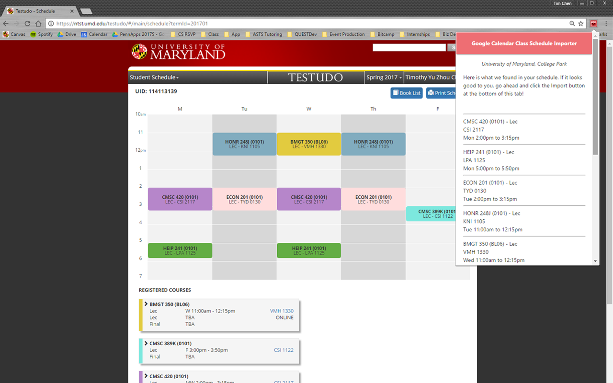
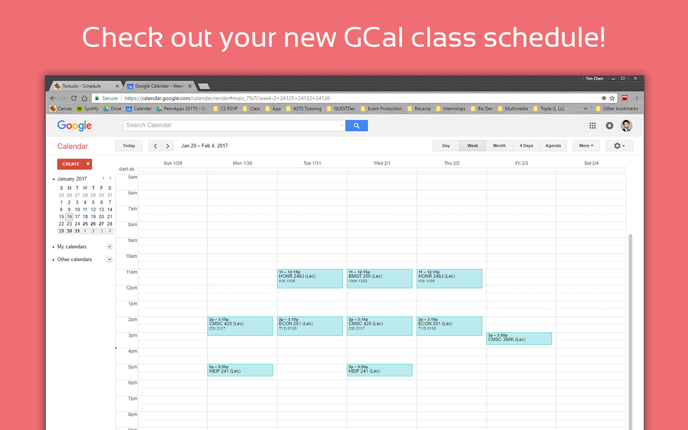
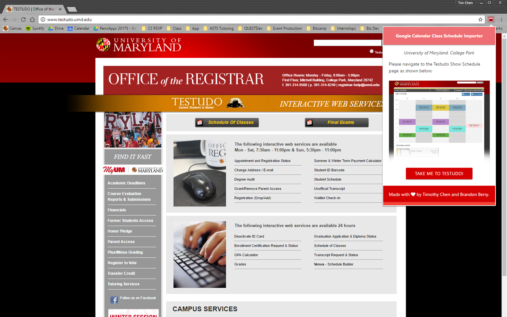

# UMD Google Calendar Schedule Importer
Imports your UMD class schedule right into a new Google Calendar!

Chrome extension parsing the page data:

The final result:

Notice to navigate to Testudo schedule page:

## Steps to Deploy to Chrome Extension Store

- Update version number (should be done each push to GitHub anyways)
- Remove the key from manifest.json (only used for testing purposes)
- Package the following files into a zip:
  - gCalFunctions.js
  - getPageSource.js
  - googleAnalytics.js
  - googleApiClient.js
  - icons
  - manifest.json
  - popup.html
  - popup.js
  - show-schedule-page-example.png
  - style.css
  
